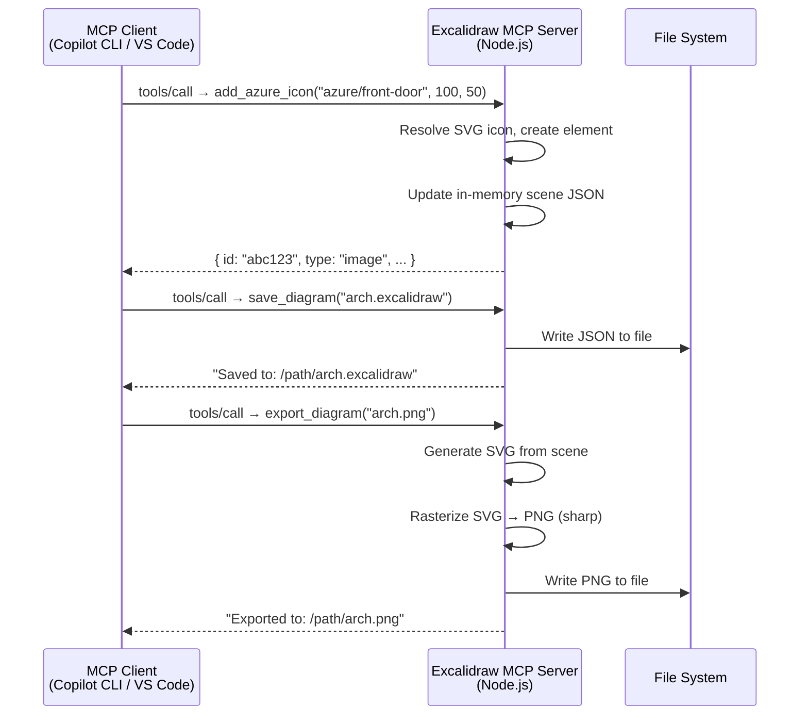

# Excalidraw MCP Server

An MCP server that exposes Excalidraw diagram operations as tools — generate Azure architecture diagrams from text descriptions.

Cross-platform, zero native dependencies. Works on macOS, Linux, and Windows.

Built for **GitHub Copilot CLI** and **VS Code Agent Mode**, but works with any MCP client.

## Features

- **Azure service icons** — 80+ Azure services with SVG icons (run `npm run build:icons` for the full 206)
- **Architecture helpers** — containers, frames, arrows with style-guide compliance
- **Element operations** — add, modify, remove, connect, and list elements
- **Multiple shape types** — rectangle, ellipse, diamond with full styling
- **Export** — `.excalidraw` (native), SVG, PNG, JPG output
- **Cross-platform** — pure Node.js, no COM interop or native addons

## Prerequisites

- **Node.js 18+**

That's it. No Windows, no Visio, no PowerShell required.

## Installation

```bash
npm install -g mcp-server-excalidraw
```

Or run directly without installing:

```bash
npx mcp-server-excalidraw
```

Or clone for local development:

```bash
git clone https://github.com/ragmha/mcp-server-excalidraw.git
cd mcp-server-excalidraw
npm install
npm run build
npm start
```

## Configuration

### Copilot CLI

Add to `~/.copilot/mcp-config.json`:

```json
{
  "mcpServers": {
    "excalidraw": {
      "type": "stdio",
      "command": "npx",
      "args": ["-y", "mcp-server-excalidraw"]
    }
  }
}
```

### VS Code

Add to `.vscode/mcp.json` or user settings:

```json
{
  "mcpServers": {
    "excalidraw": {
      "type": "stdio",
      "command": "npx",
      "args": ["-y", "mcp-server-excalidraw"]
    }
  }
}
```

### Whitelisting Tools

Auto-approve all Excalidraw tools:

```bash
copilot --allow-tool "excalidraw"
```

Or persist in `~/.copilot/config.json`:

```json
{
  "allowedTools": ["excalidraw"]
}
```

## Available Tools

### Document Management

| Tool | Description |
|---|---|
| `create_diagram` | Create a new Excalidraw diagram |
| `save_diagram` | Save to `.excalidraw` file |
| `export_diagram` | Export as PNG, SVG, or JPG |
| `get_diagram_info` | Get element count, bounding box summary |

### Element Operations

| Tool | Description |
|---|---|
| `add_element` | Add rectangle, ellipse, or diamond shapes |
| `add_azure_icon` | Add Azure service icon (embedded SVG) |
| `add_text` | Add a floating text label |
| `modify_element` | Change position, size, color, text, or style |
| `remove_element` | Remove an element by ID |
| `list_elements` | List all elements with properties |

### Connections

| Tool | Description |
|---|---|
| `add_arrow` | Connect two elements with a styled arrow |
| `remove_arrow` | Remove an arrow by ID |

### Grouping & Layout

| Tool | Description |
|---|---|
| `add_frame` | Add an Excalidraw frame (grouping boundary) |
| `add_container` | Add a styled container rectangle |

### Discovery

| Tool | Description |
|---|---|
| `list_azure_services` | List all available Azure service keys |

## Style Guide

All elements are automatically styled per `STYLE_GUIDE.md`:

- **Shapes**: clean lines (roughness=0), solid fills, 2px stroke
- **Arrows**: arrowhead endpoints, 2px stroke, dashed for failover paths
- **Containers**: dashed border, 40% opacity fill, 14px label
- **Layout**: top-to-bottom flow, ~1056×816px canvas

## Example

```
Create a 3-tier Azure architecture with Front Door, VM Scale Sets in 2 availability zones, and Azure SQL with replication
```

The server will create an Excalidraw diagram with Azure icons, containers, and styled arrows. Save as `.excalidraw` to open in [excalidraw.com](https://excalidraw.com) or the Excalidraw VS Code extension.

## Architecture



- **MCP Client** sends tool calls over stdio
- **Excalidraw MCP Server** validates inputs, manages in-memory scene, and generates output
- **File System** receives `.excalidraw` JSON files or rendered images

## Building Azure Icons

To get the full set of official Microsoft Azure Architecture Icons:

```bash
npm run build:icons
```

This downloads the [Azure Public Service Icons](https://learn.microsoft.com/en-us/azure/architecture/icons/) SVG pack, base64-encodes them, and generates `src/azure-icons.ts`. Without running this, placeholder icons are used.

## License

MIT
